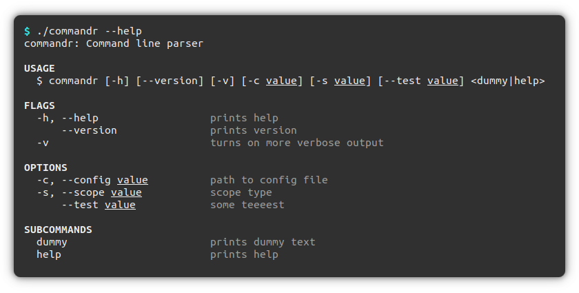

<!-- LOGO -->
<p align="center">
  <a href="https://github.com/othneildrew/Best-README-Template">
    
  </a>

  <h3 align="center">commandr</h3>

  <p align="center">
    A modern, powerful commmand line argument parser. 
    <br>
    Batteries included.
    <br />
    <br />
    <a href="https://robik.github.io/commandr/"><strong>📗 Explore the docs »</strong></a>
    <br />
    <a href="https://github.com/robik/commandr/issues">❗️ Report a bug</a>
    ·
    <a href="https://github.com/robik/commandr/issues">💡 Request feature</a>    
    <br />  
    <br />
    
    
    <br />
  </p>
</p>

- - -

**commandr** handles all kinds of command-line arguments with a nice and clean interface.
Comes with help generation, shell auto-complete scripts and validation. 


## Table of Contents

 - [Example](#example)
 - [Installation](#installation)
 - [Features](#features)
 - [Getting Started](#getting-started)
   - [Usage](#usage)
   - [Configuration](#configuration)
 - [Roadmap](#roadmap)
 - [License](#license)


## Example



## Installation

Add this entry to your `dub.json` file:

```json
  "dependencies": {
    ...
    "commandr": "~>1.0"
    ...
  }
```


## Features

 - **Flags** (boolean values)
   - Short and long forms are supported (`-v`, `--verbose`)
   - Supports stacking of flags (`-vvvv` is same as `-v -v -v`)

 - **Options** (taking a string value)
   - Short and long forms are supported (`-c test`, `--config test`)
   - Equals sign accepted (`-c=1`, `--config=test`)
   - Repeated options are supported (`-c 1 -c 2`)
   - Default values can be specified.
   - Options be marked as required.

 - **Arguments** (positional)
   - Can be marked as required
   - Default values can be specified.
   - Repeated options are supported (only last argument)

 - **Commands** (git-style)
   - Infinitely recursive subcommands (you can go as deep as needed)
   - Contains own set of flags/options and arguments
   - Dedicated help output
   - Comfortable command handling with `ProgramArgs.on()`

 - **Provided help output**
   - Generated help output for your program and sub-commands
   - Can be configured/partially overriden to suit your needs, such as forced disabling of ANSI codes.
   - Provided usage, help and version information.
   - Completly detached from core `Program`, giving you complete freedom in writing your own help output.

 - **Consistency checking**
   - When you build your program model, `commandr` checks its consistency.
   - Detects name duplications as well as short/long options.
   - Detects required parameters with default value.

 - **BASH auto-complete script**
   - You can generate completion script with single function call
   - Completion script works on flags, options and sub-commands (at any depth)
   - Acknowledges difference between flags and options

 - **Validators**
   - Passed values can be checked for correctness
   - Simple process of creating custom validating logic


## Getting Started

### Usage

```D
import std.stdio;
import commandr;

void main(string[] args) {
    auto a = new Program("test", "1.0")
          .summary("Command line parser")
          .author("John Doe <me@foo.bar.com>")
          .add(new Flag("v", null, "turns on more verbose output")
              .name("verbose")
              .repeating)
          .add(new Option(null, "test", "some teeeest"))
          .add(new Argument("path", "Path to file to edit")
              .required)
          .parse(args);

      writeln("verbosity level", a.occurencesOf("verbose"));
      writeln("arg: ", a.arg("path"));
}
```

### Configuration

## Roadmap

See the [open issues](https://github.com/robik/commandr/issues) for a list of proposed features (and known issues).

Planned features:

- TODO: default command
- TODO: aliases
- TODO: completion tests
- TODO: help subcommand
- TODO: Combined options `-qLop` (makes `-option` behind switch)
- TODO: conflicts
- TODO: programargs hierarchy conflicts
- TODO: allocator support
- TODO: With negative value (`no-` prefix)
- TODO: hinting (for completion)
- TODO: suggestions
- TODO: environment variables?
- TODO: help output grouping
- TODO: better help configuration and output (compact, smart newline)
- TODO: strict (repeating checks; options all on single is error and - option on repeating is error)
- TODO: more help customisable sections
- TODO: better print of subcommands (parent required options and args)